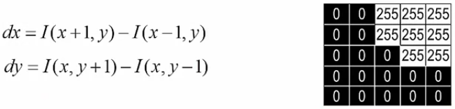
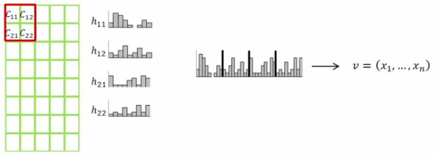

# Artistic Style

Este trabajo está basado en [A Neural Algorithm of Artistic Style](https://arxiv.org/abs/1508.06576) \[[PDF](https://arxiv.org/pdf/1508.06576.pdf)\]

## Resumen

En este trabajo se estudia las Redes Neuronales Profundas para la creación de imágenes artísticas, el sistema separa y combina el contenido y el estido de 2 imágenes cualesquiera, así la tarea de transferir el estilo de una imagen al contenido de otra puede plantearse como un problema de optimización que puede resolverse mediante el entrenamiento de una red neuronal.

## Introducción

### Redes Convolucionales

Los orígenes de las redes neuronales convolucionales se remontan a los años setenta. Pero el documento fundamental que estableció el tema moderno de las redes convolucionales fue un artículo de 1998, "El aprendizaje basado en gradientes aplicado al reconocimiento de documentos" , por Yann LeCun, Léon Bottou, Yoshua Bengio y Patrick Haffner. LeCun ha hecho un comentario interesante sobre la terminología para redes convolucionales:  "La inspiración neurológica [biológica] en modelos como redes convolucionales es muy tenue. Por eso los llamo 'redes convolucionales', no 'redes neuronales convolucionales', y por qué llamamos 'unidades' a los nodos y no 'neuronas' ".

  Red Neuronal clásica (Completamente conectada) 

#### Campos receptivos locales
En las capas completamente conectadas que se muestran anteriormente, las entradas se representaron como una línea vertical de neuronas. En una red convolucional, ayudará a pensar en lugar de las entradas como n×n cuadrado de neuronas, cuyos valores corresponden a nxn intensidades de píxeles que estamos utilizando como entradas:

Para toda la capa tenemos:

#### Pesos y sesgos(bias) compartidos

 Aquí σ puede ser la función sigmoidea, b es el bias, wlm es el peso compartido y axy es la entrada en la posicion x,y.  
 
 A menudo se dice que los pesos y sesgos compartidos definen un kernel o filtro 

Podemos representar una red, con más de un mapa de caracteristicas como:

#### Pooling de capas
Además de las capas convolucionales que acabamos de describir, las redes neuronales convolucionales también contienen capas de agrupamiento . Las generalmente van después de las capas convolucionales.

Una capa de agrupamiento toma cada mapa de características  salida de la capa convolucional y prepara un mapa de características condensado. Por ejemplo, cada unidad en la capa de agrupamiento puede resumir una región de (digamos) 5x5 neuronas en la capa anterior por ejemplo, un procedimiento común para agrupar se conoce como ___max-pooling__

#### Función de activación ReLU

Las redes de aprendizaje profundo más recientes utilizan unidades lineales rectificadas (ReLU) para las capas ocultas. Una unidad lineal rectificada tiene salida 0 si la entrada es menor que 0, y salida en bruto de lo contrario. Es decir, si la entrada es mayor que 0, la salida es igual a la entrada.

### Red VGG

En 2014, el ganador del desafío ImageNet fue una red creada por el Visual Geometry Group (VGG) en la Universidad de Oxford, logrando una tasa de error de clasificación de solo 7.0%. Al usar esta red, que ha sido entrenada para ser extremadamente efectiva en el reconocimiento de objetos, como base para tratar de extraer contenido y representar estilos de imágenes.

La red VGG consta de 16 capas de convolución y ReLU no lineal, separadas por 5 capas de agrupación y termina en 3 capas totalmente conectadas

## Método

Notación:

Los resultados se generan sobre la base de la red VGG[4] su web [aquí](http://www.robots.ox.ac.uk/~vgg/research/very_deep/), una red neuronal convolucional que rivaliza el rendimiento humano en una tarea común de referencia de reconocimiento de objetos visuales.

Dada una imagen de entrada __x__ se codifica en la Red Neuronal Convolucional por las respuestas del filtro a esa imagen.  

Una capa con Nl filtros distintos tiene Nl mapas de características de cada tamaño Ml, donde Ml es el producto de la anchura por la anchura del  mapa de características. Luego las respuestas en una capa __l__ se almacenan en una matriz Fl ∈ R Nl × Ml  donde Fijl es la activación del i-ésimo filtro en la posición j en la capa l. 

### Contenido
 Para visualizar la información de imagen que está codificada en diferentes capas de la jerarquía (reconstrucciones de contenido), realizamos el descenso de gradiente en una imagen de ruido blanco para encontrar otra imagen(__x__) que coincida con las respuestas de la característica de la imagen original(__p__). Por lo tanto, (__p__) y (__x__) son la imagen original y la imagen que se genera y Pl y Fl su representación característica respectiva en la capa l.
 A continuación, definir la pérdida de error cuadrado entre las dos representaciones de características
 
 

La derivada de esta pérdida con respecto a las activaciones en la capa __l__ es igual

### Estilo

Para obtener el estilo usamos la matriz de Gram Gl(representación de estilo), donde Gijl es el producto interno entre el mapa de caracteristicas vectorizado(representacion de caracteristicas) i y j en la capa l:

de igual forma la representación de estilo para __a__ es en la capa l es Al, entonces la contribución de la capa a la pertida total es:

la perdida total es:

donde wl es la contribución de cada capa a la perdita total. La derivada de El con respecto a la activación en la capa l es:

Finalmente la función de perdida a minimizar es:

aqui α y β son los factores de ponderación para el contenido y estilo respectivamente.

## Resultados

El código[3] usado se encuentra [aquí](https://github.com/dan01c/Artistic-Style/blob/master/img/code/code.ipynb)

Las imágenes que se usaron fueron:

## Conclusiones
### Teórico
- Las representaciones del contenido y estilo en la Red Neuronall Convolucional son separables (depende del α y β )
- Las imágenes visualmente más atractivas suelen ser creadas en las capas más profundas de la Red Neuronal Convolucional.
### Experimentales
- Los resultados muestran que al obtener mayor generaciones obtendremos una mejor representación (con 1000 generaciones podemos observar el estilo y levemente el contenido)

## Trabajos relacionados

### 1. ImageNet Classification with Deep Convolutional Neural Networks ( Clasificación de ImageNet con redes neuronales convolucionales profundas )

La red neuronal, que tiene 60 millones de parámetros y 650,000 neuronas, consta de cinco capas convolucionales, algunas de las cuales son seguidas por capas de max-pooling, y tres capas completamente conectadas al final:

#### Arquitectura

Contiene ocho capas aprendidas: cinco convolucionales y tres completamente conectadas.

Siendo el tamaño del filtro z y la longitud de paso s, cuando s&lt;z se optiene una superposición de agrupaciones. Esto es lo que usamos en toda nuestra red, con s = 2 yz = 3. Este esquema reduce las tasas de error top-1 y top-5 en 0.4% y 0.3%.

#### Reducción de sobreajuste

##### Aumento de datos
Se genera nuevas entradas mediante la traslación y reflexión horizontal de imágenes.
##### Dropout
Consiste en establecer a cero la salida de cada neurona oculta con probabilidad 0.5. Las neuronas que se "abandonan" de esta manera no contribuyen al pase hacia adelante y no participan en la propagación hacia atrás. Así las neuronas se ven forzado a aprender características más robustas.

Los núcleos en la GPU 1 son en gran parte agnósticos del color, mientras que los núcleos en la GPU 2 son en gran parte específicos del color.

__Figura__ : Los 48 kernels superiores se aprendieron en la GPU 1 mientras que los 48 kernels inferiores se aprendieron en la GPU 2

### 2. Understanding Deep Image Representations by Inverting Them ( Comprender las representaciones de imágenes profundas invirtiéndolas )

Aquí a cabo un análisis directo de la información visual contenida en las representaciones haciendo la siguiente pregunta: dada una codificación de una imagen, ¿en qué medida es posible reconstruir la imagen en sí misma?

#### Representacion HOG

Histogram of Oriented Gradients

### 3. Recognizing Image Style ( Reconociendo el estilo de la imagen )

Las imágenes creadas deliberadamente transmiten significado, y el estilo visual a menudo es un componente significativo del significado de la imagen, mientras que entender el estilo es crucial para entender la imagen, muy poca investigación en visión artificial ha explorado el estilo visual.

Aunque es muy reconocible para los observadores humanos, el estilo visual es un concepto difícil de definir rigurosamente. Se reunimos un gran conjunto de datos de arte visual (en su mayoría pinturas) anotadas con etiquetas de estilo histórico de arte, que van desde el Renacimiento hasta el arte moderno. 

Fuentes de datos:
- Flickr
- Wikipaintings (ahora wikiart)

Las etiquetas derivadas se consideran limpias en los ejemplos positivos, pero pueden ser ruidosas en los ejemplos negativos, es decir, una imagen etiquetada como Sunny es Sunny, pero también puede ser Romantic, para la que no está etiquetada.

La buenos resultados puede ser debido a que las capas que utilizamos como características son extremadamente buenas como características visuales generales para la representación de imágenes en general. Otra explicación es que el reconocimiento de objetos depende de la apariencia del objeto, por ejemplo, distinguir rojo del vino blanco, o diferentes tipos de terriers, y que el modelo aprende a reutilizar estas características para el estilo de la imagen.

## Referencias

1. Leon A. Gatys and Alexander S. Ecker and Matthias Bethge. A Neural Algorithm of Artistic Style , 2015 . URL https://arxiv.org/abs/1508.06576
2. Michael A. Nielsen, Neural Networks and Deep Learning, Determination Press, 2015. URL http://neuralnetworksanddeeplearning.com/
3. Nick McClure. TensorFlow Machine Learning Cookbook
4. Karen Simonyan & Andrew Zisserman. VERY DEEP CONVOLUTIONAL NETWORKS FOR LARGE-SCALE IMAGE RECOGNITION Recognition. arXiv:1409.1556 [cs] (2014). URL http://arxiv.org/abs/1409. 1556. ArXiv: 1409.1556.
5. Kulbear. ReLU and Softmax Activation Functions. Recuperado de https://github.com/Kulbear/deep-learning-nano-foundation/wiki/ReLU-and-Softmax-Activation-Functions
