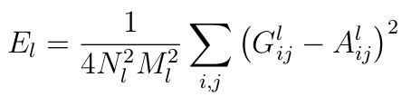

# Artistic Style

Este trabajo está basado en [A Neural Algorithm of Artistic Style](https://arxiv.org/abs/1508.06576) \[[PDF](https://arxiv.org/pdf/1508.06576.pdf)\]

## Resumen

En este trabajo se estudia las Redes Neuronales Profundas para la creación de imágenes artísticas, el sistema separa y combina el contenido y el estido de 2 imágenes cualesquiera, así la tarea de transferir el estilo de una imagen al contenido de otra puede plantearse como un problema de optimización que puede resolverse mediante el entrenamiento de una red neuronal.

## Introducción

### Redes Convolucionales

Los orígenes de las redes neuronales convolucionales se remontan a los años setenta. Pero el documento fundamental que estableció el tema moderno de las redes convolucionales fue un artículo de 1998, "El aprendizaje basado en gradientes aplicado al reconocimiento de documentos" , por Yann LeCun, Léon Bottou, Yoshua Bengio y Patrick Haffner. LeCun ha hecho un comentario interesante sobre la terminología para redes convolucionales:  "La inspiración neurológica [biológica] en modelos como redes convolucionales es muy tenue. Por eso los llamo 'redes convolucionales', no 'redes neuronales convolucionales', y por qué llamamos 'unidades' a los nodos y no 'neuronas' ".

 __Figura 1__: Red Neuronal clásica (Completamente conectada) 

## Método

Notación:

- $l$ : La capa actual
- $N_l$ : Número de filtros de la capa $l$
- $M_l$ : Tamaño de la Representación característica que es es el producto de la anchura por la anchura del  mapa de características
- $x$ : Imagen a generar
- $p$ : Contendido (imagen original)
- $a$ : Estilo
- $P^l$ : Representación característica generado por $p$
- $F^l$ : Representación característica generado por $x$
- $F^l \in R^{N_l x M_l}$
- $ F^l_{ij}$ : Activación del i-ésimo filtro en la posición $j$ de la capa $l$
- $w_l$ : Factor de contribución de cada capa para el estilo.
- $G^l$ : Representación de estilo de $x$

Los resultados se generan sobre la base de la red VGG[4] su web [aquí](http://www.robots.ox.ac.uk/~vgg/research/very_deep/), una red neuronal convolucional que rivaliza el rendimiento humano en una tarea común de referencia de reconocimiento de objetos visuales.

Dada una imagen de entrada __x__ se codifica en la Red Neuronal Convolucional por las respuestas del filtro a esa imagen.  

Una capa con Nl filtros distintos tiene Nl mapas de características de cada tamaño Ml, donde Ml es el producto de la anchura por la anchura del  mapa de características. Luego las respuestas en una capa __l__ se almacenan en una matriz Fl ∈ R Nl × Ml  donde Fijl es la activación del i-ésimo filtro en la posición j en la capa l. 

 

## Conclusiones
- Las representaciones del contenido y estilo en la Red Neuronall Convolucional son separables (depende del α y β )
- Las imágenes visualmente más atractivas suelen ser creadas en las capas más profundas de la Red Neuronal Convolucional.

## Referencias
1. Leon A. Gatys and Alexander S. Ecker and Matthias Bethge. A Neural Algorithm of Artistic Style , 2015 . URL https://arxiv.org/abs/1508.06576
